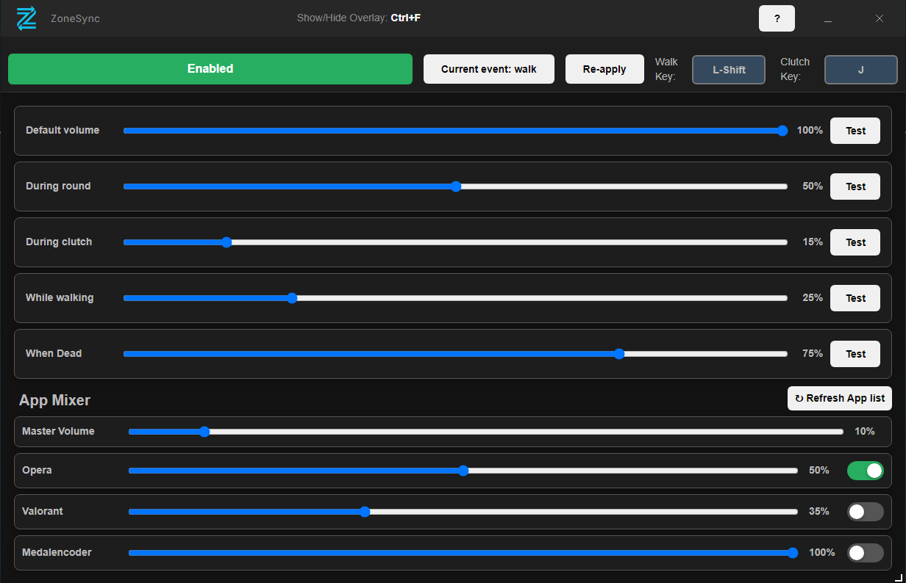

# ZoneSync

**A dynamic music volume controller for Valorant.**

## Overview
I built **ZoneSync** because I love listening to music while playing Valorant, but I constantly missed critical audio cues like enemy footsteps. Alt-tabbing to lower the volume or manually pausing tracks was distracting and often got me killed.

**ZoneSync** solves this by automatically adjusting the volume of your background apps (Spotify, Discord, Opera, etc.) based on real-time game events.

## Features
- **Dynamic Volume Control:** Automatically ducks volume during important gameplay moments.
- **Context-Aware:**
  - **Walking:** Lowers volume when you hold your Walk key (e.g., Shift).
  - **Clutch Mode:** Automatically lowers volume when you are the **last player alive** (1vX situations).
  - **Death Mode:** Restores volume when you die.
  - **Round & Buy Phase:** Custom volume levels for active combat vs. shopping time.
- **App Mixer:** choose exactly which apps you want to control (e.g., mute Spotify but keep Discord normal).

## How to use
ZoneSync uses the **Overwolf Game Events Provider (GEP)** to detect game states locally on your machine.

1. **Install** the app via the Overwolf Store.
2. **Launch Valorant.**
3. **Configure** your preferred volume levels for each game state.
4. **Play!** The app runs quietly in the background.

## Download
> **Status:** In Review / Coming Soon

ZoneSync will be available for download on the **Overwolf App Store**.

## Feedback & Support
Found a bug or have a feature request?
Contact: zonesync.help@gmail.com

